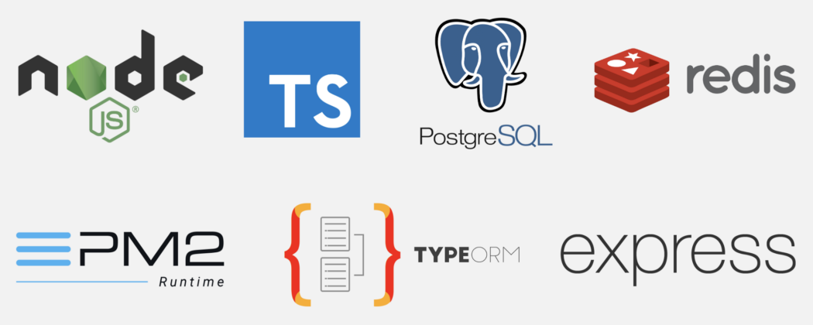

# Boilerplate Backend Server

---



> 👾 Clone this repo !

## Initialize:

```bash
cd backend
npm install
```

### 🧪 Test :

```bash
npm run dev
```

basic Http tests in .rest file

Do not uncomment handleCSRF in Middlewares : this is EXPERIMENTAL

### 🗒️ TO DO :

-  [ ] Json body validation
-  [ ] Enable caching with Redis
-  [ ] All API Endpoints and application logic
